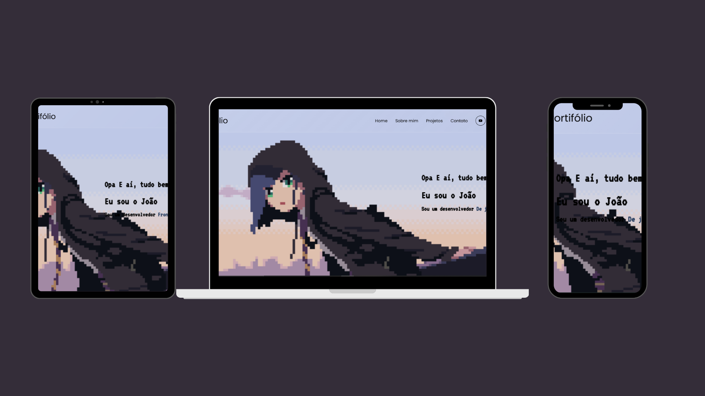

<h1 align="center">Portifólio - João 👾</h1>

<h4 align="center"><a href="https://jedev1.github.io/Meu-portifolio/">Confira o projeto aqui</a></h4>

---

## 💻 Sobre

Projeto feito com o principal objetivo de mostrar minhas habilidades como desenvolvedor.

## 🤯 O site é composto por:

- **Home:** Minha apresentação;
- **Sobre mim:** Falo um pouco sobre minha trajetória e meu estado atual;
- **Conhecimentos:** As tecnologias que tenho conhecimento;
- **Projetos:** Alguns projetos recentes que fiz;
- **Fale comigo:** Área com meios para contato comigo;
- **Redes:** Minhas redes sociais disponíveis no menu de navegação e no rodapé do site.

## 🧠 Tecnologias utilizadas:

O site **ainda está em desenvolvimento**, pois estou em constante aprendizado. Mas até aqui utilizei as tecnologias:

  

## 📚 Alguns conceitos aplicados

Neste projeto apliquei os seguintes pontos:
+ Semântica HTML;
+ Pontos de acessibilidade;
+ Responsividade;
+ Mobile first;
